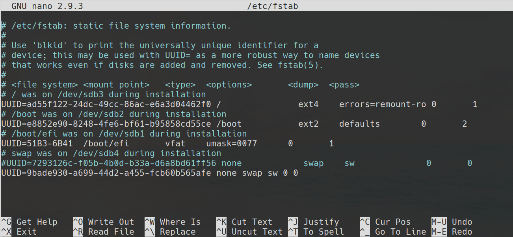

## بررسی رابط کاربری

قبل تر، در رابطه با تفاوت حالت متنی و گرافیکی رابط کاربری اشاره شد. اگرچه بسیاری از کاربران نهایی علاقه بیشتری به محیط کاربری گرافیکی به خاطر راحتی در استفاده دارند، لینوکس سنت قدرتمند رابط متنی را حفظ می‌کند. فصل ششم محیط متنی لینوکس را با جزئیات بیشتری مورد بررسی قرار می‌دهد و در فصل چهارم "استفاده از ابزار های رایج لینوکس" اصول پایه ای عملیات های محیط گرافیکی لینوکس مورد بررسی قرار می‌گیرد. مهم است که شما زمینه پایه ای اصول هر دو محیط گرافیکی و متنی را فراگیرید.

### استفاده از حالت متنی رابط کاربری

در گذشته، و یا حتی امروزه، رایانه های لینوکس در حالت متنی راه اندازی می‌شدند. زمانی که سیستم به صورت کامل راه اندازی شد، خروجی نمایشگر متنی ساده برای اعلان ورود به سیستم نمایش میدهد که تقریبا مانند متن زیر است :‌

    <code>
        Fedora release 31 (Thirty One) 
        Kernel 5.5.fc21.x86_64 on an x86_64 (tty1) 
        essentials login: 
    </code>

جزئیات چنین اعلان ورودی در سیستم های مختلف، متفاوت است. این مثال شامل تکه هایی از اطلاعات زیر است :

* نام سیستم عامل و نسخه آن : Fedora Linux 31

* نام رایانه :‌ essentials

* نام دستگاه سخت افزاری مورد استفاده برای ورود : tty1

* اعلان ورود :  :login

برای ورود به چنین سیستمی، می‌بایست نام کاربری خودتان را پس از login وارد کنید. بعد از این عمل سیستم از شما رمز عبور رو خواهد خواست که آن را هم می‌بایست تایپ کنید. اگر شما نام کاربری و رمز عبور را به درستی وارد کرده باشید ، اعلان پوسته مانند زیر به شما نمایش داده خواهد شد :

<code>[rich@essentials:∼]$</code>

در این کتاب، اکثر اعلان پوسته برای نوشتن دستورات از قلم انداخته می‌شود اگر چه فقط علامت دلار ($) به عنوان اعلان ورودی دستورات معمولی کاربر مد نظر قرار می‌گیرد. برخی از دستورات می‌بایست با دسترسی کاربر ریشه (root) وارد شوند که مدیریت سیستم عامل را بر عهده دارد، در این شرایط اعلان ورودی دستورات به علامت هشتگ (#) تغییر می‌یابد(در اکثر توزیع های برپایه لینوکس این استاندارد رعایت می‌شود!)، جزئیات اعلان پوسته درون توزیع های مختلف، متفاوت است اما در هر صورت شما می‌توانید دستورات خود را پس از اعلان پوسته وارد نمایید. بعنوان مثال میتوانید دستور ls (که مخفف list است) را برای گرفتن لیست فایل ها درون دایرکتوری در حال استفاده را وارد کنید.

> حذف حروف صدا دار، و گاهاً صامت، نام دستورات ابتدایی را کوتاه تر می‌کند تا زمان لازم برای نوشتن یک دستور و اجرای آن به حداقل برسد. اشکال این عمل اینست که برخی اوقات باعث مبهم شدن عملکرد دستور می‌شود ولی به علت کثرت ابزار ها چاره ای نیست.

برای نمونه، دستور ls لیستی از فایل ها را نمایش می‌دهد:

<code>
$ ls
<pre>106792c01.doc   f0101.tif </pre>
</code>

این مثال دو فایل را در مسیر جاری نمایش می‌دهد که یکی از آن ها 106792c01.doc و دیگری f0101.tif می‌باشد. می‌توانید دستورات دیگر، مانند cp برای کپی کردن، rm برای حذف نمودن و یا mv برای جابه‌جا کردن این فایل ها را استفاده کنید. در فصل ششم و هفتم "مدیریت فایل" چنین عملیات هایی روی فایل ها به صورت مفصل توضیح داده می‌شوند. برخی از برنامه های متنی، نمایشگر را برای ارائه به روز رسانی مداوم و یا امکان تعامل به روشی انعطاف پذیر با داده ها تحت کنترل می‌گیرند. تصویر ۱.۱، برای نمونه ویرایشگر متن nano را نمایش می‌دهد که با جزئیات در فصل دهم "ویرایش فایل ها" آن را مورد بررسی قرار می‌دهیم، هنگامی که nano در حال اجراست می‌توانید از کلید های جابه‌جایی صفحه کلید برای جابه‌جا نمودن نشانه‌گر استفاده کنید و با نوشتن متن فایل را تغییر دهید و...

*تصویر ۱.۱ برخی از ابزار های متنی تمام نمایشگر را در اختیار می‌گیرند.*

حتی اگر به صورت گرافیکی وارد سیستم شده اید، می‌توانید از محیط متنی پوسته درون پنجره‌ای(ابزاری) به نام Terminal استفاده کنید. محیط های گرافیکی معمول لینوکس قابلیت اجرای برنامه terminal را دارند که پوسته را درون خود شبیه سازی(اجرا) می‌کنند و می‌توانید به کمک آن ابزار های متنی را اجرا کنید.

### استفاده از یک رابط کاربری گرافیکی

تعداد زیادی از کاربران با محیط های گرافیکی نسبت به محیط دستور و متنی راحت ترند. بدین ترتیب بسیاری از سیستم های مدرن لینوکس به صورت پیشفرض با حالت گرافیکی راه اندازی می‌شوند و یک صفحه ورود گرافیکی مانند شکل ۱.۲ را ارئه می‌دهند که می‌توانید در آن نام کاربری خود را از یک لیست انتخاب کنید و یا آن را وارد نمایید و پس از وارد کردن پسورد وارد سیستم شوید :

*تصویر ۱.۲ صفحات ورود گرافیکی در لینوکس همانند صفحات ورود ویندوز و یا مک هستند.*

برخلاف ویندوز و مک، لینوکس دنیایی از میزکار (de) ها را در اختیار شما قرار می‌دهد که میتوانید متناسب با توزیع مدنظر خود و قابلیت های نرم افزاری میزکار و میزان مصرف منابع و علائق خود یکی(یا حتی چندین عدد) از آنها را انتخاب و استفاده کنید. میزکار های لینوکس شامل:

Gnome, KDE Plasma 5, Xfce, Mate, Cinnamon, Budgie, LXDE, LXQt, Enlightenment, KDE Plasma 4, Lumina, CDE, EDE, Razor-qt, K Desktop environment 3, ROX Desktop, ...

بسیاری از میزکار ها دارای تکنولوژی های کمکی هستند که به صورت داخلی(فقط برای همان میزکار) ارائه می‌شوند. در شکل ۱.۲ نماد شخص در بالا و سمت راست نمایشگر به شما اجازه انتخاب تکنولوژی های کمکی ارائه شده مانند screen reader , onscreen keyboard ,... را می‌دهند تا به شما برای ورود به سیستم کمک کند.
میزکار های لینوکس می‌توانند کاملا متفاوت از یکدیگر باشند اما همگی یک عمل را انجام می‌دهند. شکل ۱.۳ نمایی از میزکار KDE که به صورت پیشفرض در توزیع openSUSE ارائه شده به همراه چند نرم افزار در حال اجرا نمایش می‌دهد. در فصل چهارم محیط های میزکار معمول و ویژگی های آنها با جزئیات مورد بررسی قرار می‌گیرند، اما در حال حاضر دانستن این که همه آنها ویژگی هایی مانند زیر را به ارمغان می‌آورند کافیست:

*تصویر ۱.۳ محیط های میزکار لینوکس کنترل های گرافیکی مختلفی را ایجاد می‌کنند که انتظار اکثر کاربران است.*

**اجرا کننده های نرم افزار** شما می‌توانید با انتخاب ابزار از منو ابزار آنها را اجرا کنید. معمولاً، یک یا چند منو در بالا، پایین یا اطراف صفحه نمایش وجود دارند. در شکل ۱.۳ با کلیک کردن روی نماد openSUSE در گوشه سمت چپ-پایین صفحه نمایش، منو ابزار ها نمایش داده خواهد شد.

**مدیریت فایل ها** لینوکس مدیر فایل های گرافیکی را که مشابه ویندوز و یا مک هستند را فراهم می‌کند. مانند پنجره ای که در وسط صفحه شکل ۱.۳ نمایش داده شده است.(مدیر فایل گرافیکی Dolphin)

**کنترل پنجره ها** شما میتوانید پنجره های مختلف را با کلیک کردن و کشیدن نوار عنوان آنها را جابه‌جا کنید و با کلیک کردن و گرفتن حاشیه پنجره، اندازه آن را تغییر دهید و کار هایی از این قبیل را انجام دهید.

**چندین میزکار** اکثر میزکار های لینوکس شما را قادر می‌سازند تا چندین میزکار مجازی را فعال کنید تا در هر کدام از آنها برنامه های دلخواهتان را اجرا کنید. این ویژگی برای خلوت نگه داشتن صفحه هنگام اجرای ابزار های متفاوت کار آمد است. به صورت معمول یک نماد برای جابه‌جایی میان این میزکار های مجازی فراهم شده است.

**گزینه های خروج از سیستم** شما میتوانید از نشست(session) لینوکس خود خارج شوید، که به شما اجازه می‌دهد رایانه را خاموش کنید و یا با کاربر دیگری وارد سیستم شوید.

همینطور که درباره لینوکس اطلاعات بیشتری کسب می‌کنید، کشف می‌کنید که محیط های گرافیکی آن کاملاً انعطاف پذیر هستند. اگر محیط گرافیکی پیش فرض توزیع لینوکسی خود را نمی‌پسندید، می‌توانید آن را تغییر دهید. اگرچه تمامی آنها قابلیت های مشابهی را ارائه می‌دهند، برخی افراد نسبت به میزکار ها اولویت های محکمی دارند. در واقع لینوکس انتخاب هایی را در اختیار شما قرار می‌دهد که در ویندوز و یا مک این آزادی انتخاب را نخواهید داشت، پس برای امتحان چندین میزکار مختلف احساس آزادی داشته باشید.
