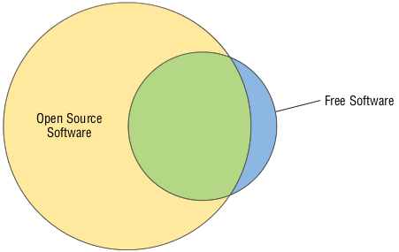


## سازمان پیشگامان متن باز (OSI)

اشخاص Bruce Perens و Eric S. Raymond در سال 1988 سازمان Open Source Initiative یا OSI را بعنوان یک سازمان اصلی (Umbrella organization) برای نرم افزارهای متن باز تاسیس کردند.

> Umbrella Organization به شرکتی گفته می‌شود که وظیفه سازماندهی و مدیریت سیار زیرمجموعه های مرتبط با خود را دارد.

فلسفه این سازمان در جزئیات مهم با FSF تفاوت دارد هرچند که به صورت کلی مشابه با یکدیگر هستند. به عنوان یک قاعده کلی، در روش بیان بنیاد نرم افزار آزاد مشخص می‌شود که نرم افزار آزاد با نرم افزار متن باز تفاوت هایی دارد  و آنچه بعنوان نرم افزار متن باز شناخته می‌شود به تعبیر دقیق OSI بستگی دارد که از نظر مجوز های آن تایید شده باشد.

### درک فلسفه متن باز

در دهه های 1980 و 1990 ، جنبش نرم افزار آزاد در محافل خاص ، از جمله دانشگاه ها و در بین سرگرمی ها ، شتاب بیشتری به خود گرفت. با این حال، مشاغل نسبت به اتخاذ نرم افزار آزاد به صورت آهسته پیش می‌رفتند. بسیاری از اشخاص با اکراه و یا به اجبار استفاده از نرم افزار متن باز را پذیرفتند، مانند مدیران سیستمی که به خاطر بودجه کم مجبور به استفاده از لینوکس و ابزارهای Apache, Samba و  سایر نرم افزارهای متن بازِ مشابهِ گزینه های گران قیمت تجاری شدند.

تلاش های FSF در طرفداری از نرم افزار آزاد بر پایه یک سری ضرورت اخلاقی محکم بوده است و از نظر FSF نرم افزار باید ٬آزاد٬ باشد!(که قبلاً در مورد این آزادی نرم افزار توضیح داده‌ایم.) این رویکرد برای برخی افراد جذاب است اما برای برخی دیگر،‌به خصوص مشاغلی که با فروش نرم افزار کسب درآمد دارند، در بهترین حالت ٬عجیب٬ و در بهترین حالت ٬تهدید٬ محسوب می‌شود.

به همین دلایل، سازندگان OSI سازمان خود را به عنوان راهی برای دفاع از نرم افزار آزاد طراحی کردند. OSI با استفاده از اصطلاح جدید ٬متن باز٬‌ و با نرم کردن برخی از ضروریات اخلاقی FSF، قصد دارد که نرم افزار متن باز را در جهان تجارت وارد کند. تفاوت این ضرورت اخلاقی FSF را می‌توان در بیانیه های ماموریتی وب سایت [OSI](https://opensource.org/) مشاهده کرد:

> **متن باز**

> متن باز شیوه جدیدی برای  توسعه(نرم افزار) می باشد که از قدرت بازبینی اشتراکی و شفافیت کار بهره مند است. وعده متن باز کیفیت بهتر، قابلیت اطمینان بالاتر، انعطاف پذیری بیشتر، هزینه کمتر و پایانی برای قفل فروش فروشنده درنده است.

بزرگترین تفاوت فلسفی بین FSF و OSI در الزام GPL منعکس شده است که آثار مشتق شده از نرم افزار تحت GPL باید دوباره با این مجوز منتشر شوند. OSI دارای مجوزهای زیادی برای نرم افزارهای متن باز،‌ از جمله GPL، را دارد؛ هرچند بسیاری از این مجوزها محدودیت های مشابهی ندارند. در گذشته نرم افزاری که تحت چنین مجوزهایی منتشر شد در نهایت به سمت محصولات متن/منبع بسته(closed-source) راه پیدا کرد. OSI به چنین مسیری اعتراض نمی‌کند، مشروط بر اینکه این نرم افزار به روشی که اجازه آنا را صادر کرده باشد مجوز بگیرد.  از طرف دیگر، FSF صریحاً چنین روش تغییر مجوزی را در GPL ممنوع اعلام کرده است.

به عنوان یک قاعده کلی، نرم افزار آزاد به تعبیر FSF یک نرم افزار متن باز هم هست! اگرچه برخی مجوزهایی که FSF آن را آزاد می‌شناسد، توسط OSI تایید نشده اند. اگرچه بسیاری از مجوزهای متن باز نیز از نظر FSF آزاد نیستند. شکل ۲.۱ این رابطه را بهتر نمایش می‌دهد:

تصویر ۲.۱ : بیشتر نرم افزارهای آزاد متن باز هستند اما مقدار قابل توجهی از نرم افزارهای متن باز آزاد نیستند.

امروزه، تنش هایی بین مخلصان راه FSF و نرم افزار آزاد در مقابل جامعه متن باز وجود دارد. با این حال در بیشتر قسمت ها، اهداف مشترکی را دنبال می‌کنند که به اندازه کافی مشابه هستند تا تفاوت بین آنها را به کمتر از حداقل می‌رساند. در حقیقت، دو اصطلاح نرم افزار متن باز و آزاد(FOSS) و نرم افزار آزاد خالص(FLOSS) گاهاً به عنوان اصطلاحات چتری مورد استفاده قرار می‌گیرند تا صریحاً به هر دو نوع نرم افزار و روش توسعه اشاره شود.

    <blockquote> FOSS : Free OpenSource Software FLOSS : Free/Libre OpenSource Software</blockquote>

### تعریف نرم افزار متن باز
در [اینجا](https://opensource.org/definition) نرم افزار متن باز تعریف شده که دارای ۱۰ اصل مشخص می‌باشد ؛ که به صورت خلاصه توضیح می‌دهیم:

**۱. آزاد بودن توزیع دوباره (Free Redistribution)**

مجوز می‌بایست اجازه توزیع مجدد؛ از جمله توزیع مجدد یک نرم افزار را بعنوان بخشی از یک پروژه بزرگتر بدهد.

**۲. در دسترس بودن کد منبع (Source Code)**

 صاحب نرم افزار باید کد منبع را در دسترس قرار داده و اجازه توزیع مجدد کد منبع و (در صورت وجود) کد باینری را نیز بدهد.

**۳. اجازه به ادامه فعالیت پروژه های مشتق شده (Derived Works)**

مجوز باید به دیگران اجازه دهد تا نرم افزار را تغییر داده و چنین اصلاحاتی را با همان مجوز اصلی توزیع کنند.

**۴. احترام به یکپارچگی کد منبع (Integrity of The Author's Source Code)**

مجوز ممکن است توزیع مجدد کد منبع اصلاح شده را محدود کند، اما در این شرایط هم توزیع وصله های نرم افزار(patch files) همراه با کد منبع اصلی ممکن است.این چنین مجوزی ممکن است مستلزم این باشد که آثار مشتق شده، نام یا شماره نسخه نرم افزار را تغییر دهد.

**۵. هیچ تبعیضی علیه افراد یا گروه ها وجود ندارد (No Discrimination Against Persons or Groups)**

مجوز نباید بین افراد یا گروه های مختلف تبعیض قائل شود.

**۶. هیچ تبعیضی در زمینه کاربرد نیست (No Discrimination Against Fields of Endeavor)**

مجوز نباید استفاده از برنامه را در زمینه‌ های مختلف، مثلا در تجارت یا استفاده توسط محققان ژنتیک، منع کند.

**۷. توزیع مجوز خودکار (Distribution of License)**

مجوز باید برای هر کسی که برنامه را دریافت می‌کند، بدون نیاز به توافق جداگانه اعمال شود.

**۸. مجوز فقط نباید مختص یک محصول باشد (License Must Not Be Specific to a Product)**

مجوز نباید مستلزم استفاده یا توزیع برنامه به عنوان بخشی از یک برنامه بزرگتر باشد - یعنی شما می‌توانید یک برنامه واحد را از یک مجموعه بزرگتر استخراج کرده و مجدداً توزیع کنید.

**۹. عدم محدودیت در سایر نرم افزارها (License Must Not Restrict Other Software)**

مجوز نباید محدودیت هایی را برای سایر نرم افزارهایی که به همراه آن ارائه میشوند اعمال کند.

**۱۰. خنثی بودن تکنولوژی (License Must Be Technology-Neutral)**

مجوز نباید بر اساس فن آوری های خاص یا رابط ها محدود شود.

سه مورد اول این اصول، حداقل از نظر درک نقطه نظر منبع باز، بسیار مهم هستند. این مجموعه به صورت کلی شباهت کاملی با چهار اصل بنیاد نرم افزار آزاد دارد و شرح مفاهیم آن در صحفه وب [FSF](https://www.gnu.org/philosophy/free-sw.html) موجود است. با این حال، همانطور که قبلاً توضیح داده شد، به ویژه در مورد الزامات صدور مجوز برای کارهای مشتق شده تفاوت هایی وجود دارد.

> توجه کنید که تعریف نرم افزار آزاد توسط OSI برگرفته از خطوط راهنمای نرم افزار آزاد دبیان (DFSG) است.

در نهایت در سال ۲۰۲۰ [مجوز های محبوب تایید شده توسط OSI](https://opensource.org/licenses) شامل موارد زیر است :

<ul>
    <li><a href="https://opensource.org/licenses/Apache-2.0">Apache License 2.0</a></li>
    <li><a href="https://opensource.org/licenses/BSD-3-Clause">BSD 3-Clause "New" or "Revised" license</a></li>
    <li><a href="https://opensource.org/licenses/BSD-2-Clause">BSD 2-Clause "Simplified" or "FreeBSD" license</a></li>
    <li><a href="https://opensource.org/licenses/gpl-license">GNU General Public License (GPL)</a></li>
    <li><a href="https://opensource.org/licenses/lgpl-license">GNU Library or "Lesser" General Public License (LGPL)</a></li>
    <li><a href="https://opensource.org/licenses/MIT">MIT license</a></li>
    <li><a href="https://opensource.org/licenses/MPL-2.0">Mozilla Public License 2.0</a></li>
    <li><a href="https://opensource.org/licenses/EPL-2.0">Eclipse Public License 2.0</a></li>
    <li><a href="https://opensource.org/licenses/CDDL-1.0">Common Development and Distribution License</a></li>
</ul>

