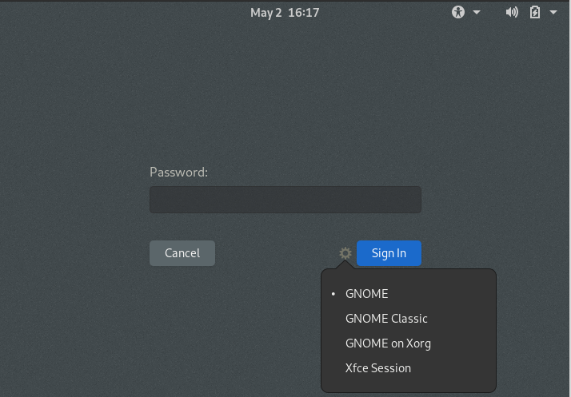

## استفاده از یک محیط کاربری(میزکار) لینوکس

احتمال بالایی دارد که اولین تجربه شما با سیستم عامل لینوکس شامل تجربه یک محیط گرافیکی(میزکار) نیز شود. محیط میزکار مجموعه ای از برنامه هایی است که نمایشگر را کنترل می‌کنند و همچنین برنامه های کمکی را برای انجام کارهایی مانند مدیریت فایل ها ارائه می‌دهد. در سیستم عامل گنو/لینوکس چندین انتخاب برای محیط میزکار خواهید داشت، بنابراین اگر یکی از آنها را دوست ندارید، می‌توانید گزینه های دیگر را انتخاب کنید. در این بخش علاوه بر ارائه اطلاعات در مورد برخی از محیط های میزکار موجود، چند ابزار که می‌توانید برای اجرای برنامه ها و مدیریت فایل ها استفاده کنید، توصیف می‌شود.

### انتخاب یک محیط میزکار

وابسته به توزیع انتخاب شده و نحوه نصب آن، عمدتاً بیش از یک محیط میزکار برای شما در دسترس و قابل انتخاب خواهد بود. رایج ترین محیط های میزکار شامل موارد زیر می‌شوند:

**KDE**

K Desktop Environment یا [KDE](https://kde.org/) یکی از محیط های میزکار مشهور و محبوب لینوکس است. KDE توسط توزیع های Mandriva و OpenSUSE به صورت پیشفرض عرضه می‌شود. این میزکار شامل ابزار های قدرتمند بسیاری است که به خوبی با یکدیگر هماهنگ شده اند. این میزکار به کمک مجموعه ابزارهای Qt ساخته شده است.

**GNOME**

میزکار [GNOME](https://www.gnome.org/) نیز یک محیط میزکار لینوکسی مشهور است. این میزکار به صورت پیشفرض در توزیع های Fedora و Debian عرضه می‌شود. میزکار GNOME به کمک چهارچوب +GTK ایجاد شده است. همانند KDE، میزکار GNOME نیز شامل ابزارهای قدرتمند فراوانی است که به صورت هماهنگ با هم عمل می‌کنند. GNOME قصد دارد تا میزکاری با استفاده آسان را ارائه دهد.

**Xfce**

[این محیط میزکار مشهور](https://www.xfce.org/) در ابتدا در یک محیط میزکار تجاری معروف به نام CDE مدل سازی شده بود، اما با استفاده از چهارچوب +GTK به وجود آمد. Xfce قابلیت شخصی سازی خوب و ساده ای را برای کاربران خود ارائه می‌دهد و به راحتی‌ می‌توانید موارد مختلف موجود در میزکار را مطابق سلیقه خود تنظیم کنید. هدف این میزکار مصرف کمتر از منابع سیستم نسبت به سایر محیط های میزکار است.

**محیط میزکار ساخته شده توسط خودتان**

ساخت محیط میزکار اختصاصی با اجزاء دلخواهتان ممکن است. از آنجا که این عمل می‌تواند نسبتاً پیچیده باشد، بهتر است از راهنمایی های دقیق کمک بگیرید. کافیست به موتور جست و جوی وب محبوب خود وارد شوید و جمله

<strong>how to create your own Linux desktop environment</strong>

را جست و جو کنید. برای ساخت میزکار شخصیتان حداقل به یک مدیر پنجره نیاز خواهید داشت. با این حال، برای پیکربندی یک محیط میزکار واقعی، به اجزای دیگری مانند مدیر فایل و ابزار های بهره وری کوچکتری نیاز پیدا می‌کنید. همه مؤلفه بایداز نوعی سیستم منو در دسترس کاربر قرار گیرند.

متأسفانه ارائه دستورالعمل برای قیاس عملکرد بهتر محیط های میزکار نسبت به یکدیگر غیر ممکن است. با این حال توصیه هایی که ارائه خواهیم داد ممکن است به شما کمک کنند. کاربران تازه وارد به دنیای گنو/لینوکس که به استفاده از سیستم عامل MS Windowns و یا MacOS عادت کرده اند، احتمالاً KDE را میزکار مناسبی برای خود بیابند. محیط KDE مشابه محیط سیستم عامل های رومیزی سنتی است و البته با تغییرات این میزکار در آخرین نسخه ها و تغییر یافتن به Plasma قضیه کمی متفاوت تر شده و می‌توان برای کاربران سیستم عامل های رایج رومیزی میزکار Cinnamon را نیز یک میزکار با محیطی آشنا دانست ؛ میزکار Cinnamon شاخه ای از میزکار GNOME است که قابلیت شخصی سازی همانند Xfce را ارائه می‌دهد. میزکار GNOME هم با هدف استفاده آسان ارائه می‌شود نیز می‌تواند تجربه خوبی را از محیط میزکار لینوکس به کاربر منتقل کند. کاربرانی که با سیستم عامل های تجاری یونیکس آشنا هستند نیز ممکن است به استفاده از Xfce بپردازند. میزکار های Xfce و LXDE گزینه های خوبی برای اشخاصی هستند که از سیستم های با منابع ضعیف و محدود یا پردازنده های کم مصرف استفاده می‌کنند. افرادی که دوست دارند همه چیز را شخصی سازی کنند یا رایانه هایی ضعیفی دارند به استفاده از مدیر پنجره ها یا ساخت میزکار شخصی خودشان خواهند پرداخت.

قبل از این که تصمیم بگیرید که یک محیط میزکار خاص را برای استفاده روزانه خود انتخاب کنید، احتمالاً نیاز داشته باشید که دو یا سه مورد از محیط های میزکار را امتحان کنید. در اکثر مواقع نیز می‌توانید چندین محیط میزکار را در سیستم عامل گنو/لینوکسی خود نصب و استفاده کنید که در فصل ۹ با این موارد بیشتر آشنا خواهیم شد. پس از نصب محیط میزکار خود، هنگام ورود به رایانه می‌توانید از طریق منو ارائه داده شده توسط مدیریت نمایشگر(display manager) محیط مورد نظر خود را برای راه اندازی انتخاب کنید؛ بعنوان مثال در شکل ۴.۱ صفحه ورود GDM را نشان می‌دهد. در این حالت برای دسترسی به منو تغییر میزکار باید روی دکمه "چرخ دنده" کنار دکمه "Sign In" کلیک کنید:

> **تصویر ۴.۱** مدیریت ورود گرافیکی عموماً گزینشی از محیط های میزکار نصب شده روی سیستم را فراهم میکنید که می‌توانید یکی از آنها را برای اجرا و استفاده انتخاب کنید.

 توجه کنید که این عمل در display manager ها متفاوت است! در GDM ابتدا باید نام کاربری خود را وارد کنید و سپس در مرحله وارد نمودن رمز عبور خود این دو دکمه را مشاهده خواهید نمود. در تصویر ۴.۱ مشاهده می‌کنید که حق انتخاب دو میزکار GNOME و Xfce را داریم؛ چرا که این دو میزکار در توزیع مورد استفاده نصب شده اند. نحوه انتخاب یک محیط میزکار در یک سیستم با سیستم دیگر متفاوت است، بنابراین ممکن است شما نیاز به دنبال گزینه های صفحه ورود به سیستم خود برای انتخاب محیط مورد نظر خود داشته باشید.

### اجرای ابزارها

