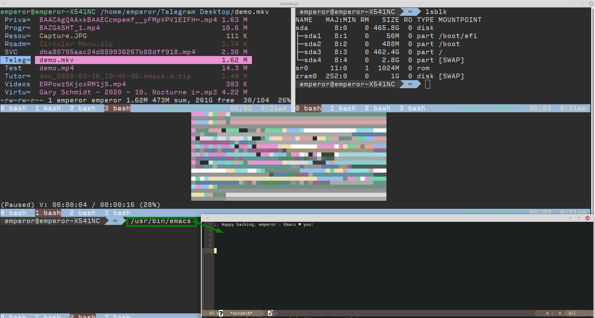

## استفاده از یک محیط کاربری(میزکار) لینوکس

احتمال بالایی دارد که اولین تجربه شما با سیستم عامل لینوکس شامل تجربه یک محیط گرافیکی(میزکار) نیز شود. محیط میزکار مجموعه ای از برنامه هایی است که نمایشگر را کنترل می‌کنند و همچنین برنامه های کمکی را برای انجام کارهایی مانند مدیریت فایل ها ارائه می‌دهد. در سیستم عامل گنو/لینوکس چندین انتخاب برای محیط میزکار خواهید داشت، بنابراین اگر یکی از آنها را دوست ندارید، می‌توانید گزینه های دیگر را انتخاب کنید. در این بخش علاوه بر ارائه اطلاعات در مورد برخی از محیط های میزکار موجود، چند ابزار که می‌توانید برای اجرای برنامه ها و مدیریت فایل ها استفاده کنید، توصیف می‌شود.

### انتخاب یک محیط میزکار

وابسته به توزیع انتخاب شده و نحوه نصب آن، عمدتاً بیش از یک محیط میزکار برای شما در دسترس و قابل انتخاب خواهد بود. رایج ترین محیط های میزکار شامل موارد زیر می‌شوند:

**KDE**

K Desktop Environment یا [KDE](https://kde.org/) یکی از محیط های میزکار مشهور و محبوب لینوکس است. KDE توسط توزیع های Mandriva و OpenSUSE به صورت پیشفرض عرضه می‌شود. این میزکار شامل ابزار های قدرتمند بسیاری است که به خوبی با یکدیگر هماهنگ شده اند. این میزکار به کمک مجموعه ابزارهای Qt ساخته شده است.

**GNOME**

میزکار [GNOME](https://www.gnome.org/) نیز یک محیط میزکار لینوکسی مشهور است. این میزکار به صورت پیشفرض در توزیع های Fedora و Debian عرضه می‌شود. میزکار GNOME به کمک چهارچوب +GTK ایجاد شده است. همانند KDE، میزکار GNOME نیز شامل ابزارهای قدرتمند فراوانی است که به صورت هماهنگ با هم عمل می‌کنند. GNOME قصد دارد تا میزکاری با استفاده آسان را ارائه دهد.

**Xfce**

[این محیط میزکار مشهور](https://www.xfce.org/) در ابتدا در یک محیط میزکار تجاری معروف به نام CDE مدل سازی شده بود، اما با استفاده از چهارچوب +GTK به وجود آمد. Xfce قابلیت شخصی سازی خوب و ساده ای را برای کاربران خود ارائه می‌دهد و به راحتی‌ می‌توانید موارد مختلف موجود در میزکار را مطابق سلیقه خود تنظیم کنید. هدف این میزکار مصرف کمتر از منابع سیستم نسبت به سایر محیط های میزکار است.

**محیط میزکار ساخته شده توسط خودتان**

ساخت محیط میزکار اختصاصی با اجزاء دلخواهتان ممکن است. از آنجا که این عمل می‌تواند نسبتاً پیچیده باشد، بهتر است از راهنمایی های دقیق کمک بگیرید. کافیست به موتور جست و جوی وب محبوب خود وارد شوید و جمله

<strong>how to create your own Linux desktop environment</strong>

را جست و جو کنید. برای ساخت میزکار شخصیتان حداقل به یک مدیر پنجره نیاز خواهید داشت. با این حال، برای پیکربندی یک محیط میزکار واقعی، به اجزای دیگری مانند مدیر فایل و ابزار های بهره وری کوچکتری نیاز پیدا می‌کنید. همه مؤلفه بایداز نوعی سیستم منو در دسترس کاربر قرار گیرند.

متأسفانه ارائه دستورالعمل برای قیاس عملکرد بهتر محیط های میزکار نسبت به یکدیگر غیر ممکن است. با این حال توصیه هایی که ارائه خواهیم داد ممکن است به شما کمک کنند. کاربران تازه وارد به دنیای گنو/لینوکس که به استفاده از سیستم عامل MS Windowns و یا MacOS عادت کرده اند، احتمالاً KDE را میزکار مناسبی برای خود بیابند. محیط KDE مشابه محیط سیستم عامل های رومیزی سنتی است و البته با تغییرات این میزکار در آخرین نسخه ها و تغییر یافتن به Plasma قضیه کمی متفاوت تر شده و می‌توان برای کاربران سیستم عامل های رایج رومیزی میزکار Cinnamon را نیز یک میزکار با محیطی آشنا دانست ؛ میزکار Cinnamon شاخه ای از میزکار GNOME است که قابلیت شخصی سازی همانند Xfce را ارائه می‌دهد. میزکار GNOME هم با هدف استفاده آسان ارائه می‌شود نیز می‌تواند تجربه خوبی را از محیط میزکار لینوکس به کاربر منتقل کند. کاربرانی که با سیستم عامل های تجاری یونیکس آشنا هستند نیز ممکن است به استفاده از Xfce بپردازند. میزکار های Xfce و LXDE گزینه های خوبی برای اشخاصی هستند که از سیستم های با منابع ضعیف و محدود یا پردازنده های کم مصرف استفاده می‌کنند. افرادی که دوست دارند همه چیز را شخصی سازی کنند یا رایانه هایی ضعیفی دارند به استفاده از مدیر پنجره ها یا ساخت میزکار شخصی خودشان خواهند پرداخت.

قبل از این که تصمیم بگیرید که یک محیط میزکار خاص را برای استفاده روزانه خود انتخاب کنید، احتمالاً نیاز داشته باشید که دو یا سه مورد از محیط های میزکار را امتحان کنید. در اکثر مواقع نیز می‌توانید چندین محیط میزکار را در سیستم عامل گنو/لینوکسی خود نصب و استفاده کنید که در فصل ۹ با این موارد بیشتر آشنا خواهیم شد. پس از نصب محیط میزکار خود، هنگام ورود به رایانه می‌توانید از طریق منو ارائه داده شده توسط مدیریت نمایشگر(display manager) محیط مورد نظر خود را برای راه اندازی انتخاب کنید؛ بعنوان مثال در شکل ۴.۱ صفحه ورود GDM را نشان می‌دهد. در این حالت برای دسترسی به منو تغییر میزکار باید روی دکمه "چرخ دنده" کنار دکمه "Sign In" کلیک کنید:

> **تصویر ۴.۱** مدیریت ورود گرافیکی عموماً گزینشی از محیط های میزکار نصب شده روی سیستم را فراهم میکنید که می‌توانید یکی از آنها را برای اجرا و استفاده انتخاب کنید.

 توجه کنید که این عمل در display manager ها متفاوت است! در تصویر اول که مدیر نمایشگر GDM است ابتدا باید نام کاربری خود را وارد کنید و سپس در مرحله وارد نمودن رمز عبور خود این دو دکمه را مشاهده خواهید نمود، مشاهده می‌کنید که حق انتخاب دو میزکار GNOME و Xfce را داریم؛ چرا که این دو میزکار در توزیع مورد استفاده نصب شده اند. نحوه انتخاب یک محیط میزکار در یک سیستم با سیستم دیگر متفاوت است، بنابراین ممکن است شما نیاز به دنبال گزینه های صفحه ورود به سیستم خود برای انتخاب محیط مورد نظر خود داشته باشید. بعنوان مثال می‌توان به تصویر دوم که مدیر نمایشگر LightDM است اشاره نمود که بر خلاف GDM لیست کاربران در صفحه ورود موجود است و دکمه انتخاب میزکار در مکان متفاوتی وجود دارد. عمدتاً مدیر نمایشگر (DisplayManager)ها متناسب با میزکار انتخاب می‌شوند؛ بعنوان مثال GDM برای میزکار GNOME و LightDM برای میزکارهایی همچون Xfce و یا KDM برای میزکار Plasma ,...

### اجرای ابزارها

اکثر محیط های میزکار راه های مختلفی را برای اجرای برنامه ها فراهم می‌کنند. جزئیات این مورد در محیط های میزکار می‌تواند متفاوت از یکدیگر باشند. به عنوان مثال می‌توانیم به چند مورد اشاره کنیم:

**منو های میزکار**

بسیاری از محیط های میزکار منو ها را در سینی وضعیت(Panel, Status Bar, ...) یا در اطراف صفحه برای کاربر ارائه کرده اند. این منوها شامل دسته بندی ابزار های سیستم عامل و همچنین مواردی مانند ابزارهای مورد علاقه شما و یا ابزارهایی که اخیراً اجرا کرده اید می‌شوند.

> **تصویر ۴.۲** نمایی از منو میزکار Xfce به نام Whisker Menu

**نماد(آیکُن) های میزکار**

برخی از محیط های میزکار شما را قادر می‌سازند تا در صفحه اصلی میزکار خود آیکُن ابزارها(که در لینوکس به عنوان فایل های desktop. شناخته می‌شوند) را قرار داده و با کلیک کردن روی آنها ابزار مورد نظر خود را اجرا کنید. این روش قاعدتاً به شخصی سازی هایی نیاز خواهد داشت. البته برخی از محیط های میزکار از قبل پیکربندی شده(توسط ارائه دهنده توزیع) ممکن است تعدادی از ابزارها را در محیط اصلی میزکار قرار داده باشند.

> **تصویر ۴.۳** نماد ابزار های مختلف در صفحه اصلی میزکار، در میزکار Xfce به راحتی قابلیت ویرایش فایل های desktop را خواهید داشت.

**نوار وضعیت (Panel)**

اکثر محیط های میزکار، نوار وضعیت یا Panel را نیز ارائه می‌دهند که در این مورد نیز می‌توانید موارد دلخواه خود را در پَنِل جا دهید؛ از جمله آیکُن ابزار هایی که معمولاً استفاده می‌کنید، البته در این بخش شما قادر به افزودن موارد(ویجت، افزونه، ...) های مختلف دیگر نیز برای استفاده آسان از سیستم خود خواهید بود.

> **تصویر ۴.۴** شخصی سازی فوق العاده آسان پنل در میزکار Xfce و افزونه های مختلف برای استفاده بهتر و نمایش اطلاعات سیستم و دسترسی آسان به ابزار ها

**منو های زمینه**

گاهی اوقات میتوانید با کلیک-راست در بخش خالی صفحه اصلی محیط میزکار، منو اجرای ابزار ها را در گزینه های موجود ارائه شده ببینید.

> **تصویر ۴.۵** در میزکار Xfce میتوانید تا حدی منو زمینه را شخصی سازی کنید

**جست و جو برای برنامه ها**

در برخی از میزکارها ابزارهایی برای جست و جو و اجرای ابزارها ارائه شده است. معمولاً نام برنامه مورد نظر خود را وارد می‌کنید و در لیست ابزارها نمایش داده خواهد شد. سپس می‌توانید با انتخاب برنامه، آن را اجرا کنید.

> **تصویر ۴.۶** نمونه های ساده و کاربر پسند جست و جو گر نرم افزار در میزکار Xfce

**پایانه خط فرمان**

می توانید برنامه ای به نام *Terminal* را اجرا کنید که یک رابط کاربری متنی(پوسته) را درون یک پنجره در اختیار شما قرار می‌دهد. در این محیط می‌توانید برنامه های حالت متنی و یا گرافیکی را با وارد کردن نام فایل اجرایی آن ها، اجرا کنید. این روش با جزئیات بیشتر در فصل ۶ مورد بررسی قرار خواهد گرفت.

> **تصویر ۴.۷** شما قابلیت اجرای انواع ابزارها را به روش های مختلف به کمک پوسته شبیه سازی شده در پایانه خط فرمان(Terminal) را دارید. در این تصویر به ترتیب از راست به چپ و از بالا به پایین ابزار های ranger و lsblk و mpv(در اینجا ویدیو به کمک tct رندر می‌شود) و در نهایت ویرایشگر گرافیکی emacs اجرا شده اند.

البته منوهای مختلف دیگری نیز وجود دارد مانند [dmenu](https://tools.suckless.org/dmenu/) که جزو ابزار های suckless برای رابط X می‌باشد. دنیای گنو/لینوکس سرشار از ابزار های مختلف است که دسته بندی آنها گاهاً سخت می‌شود. وابسته به نیاز شما و محیطی که از آن استفاده می‌کنید، این ابزار ها تغییر پیدا می‌کنند. دست شما برای ایجاد انواع تغییرات باز است و حتی می‌توانید ابزار خودتان را برای اجرای ابزارها ایجاد کنید و یا روش خود را اختراع کنید!

### استفاده از یک مدیر فایل

اگر از Windows یا Mac OS X استفاده کرده باشید قطعا از یک *مدیر فایل* برای اداره کردن فایل های خود استفاده کرده اید. در سیستم عامل لینوکس نیز می‌توانید از مدیر فایل ها به صورت متنوعی استفاده کنید(ابزار های رابط گرافیکی و متنی متنوع برای این امر وجود دارند). بعنوان مثال برای میزکار GNOME مدیر فایل Nautilus ساخته شده،‌ یا برای میزکار Plasma مدیر فایل Dolphin، و یا ابزار مدیر فایل Thunar که برای میزکار Xfce فراهم آمده و یا حتی مدیر فایل های متنوع رابط متنی همچون Ranger یا Midnight Commander و ... نیز وجود دارند. لیستی از مدیر فایل های مختلف را می‌توانید در [اینجا](https://wiki.archlinux.org/index.php/Category:File_managers) مشاهده کنید.

> **تصویر ۴.۸** تصویری از محیط مدیر فایل Thunar در محیط میزکار Xfce

در اکثر توزیع های گنو/لینوکس که همراه با میزکار ارائه می‌شوند مدیر فایل به صورت پیشفرض وجود دارد. عمدتاً هنگامی که یک فضای ذخیره سازی همچون USB Flash و یا دیسک DVD را به سیستم متصل می‌کنید مدیر فایل به صورت خودکار در محیط میزکار اجرا می‌شود. تصویر ۴.۹ مدیر فایل Thunar را پس از اتصال فضای ذخیره سازی نمایش می‌دهد:

> **تصویر ۴.۹** نمایش خودکار محتوای فضای ذخیره سازی متصل شده در مدیر فایل Thunar

در سمت چپ انواع مدیر فایل عمدتاً چندین بخش وجود دارد که در تصویر بالا(مدیر فایل Thunar)  شامل موارد زیر می‌شوند:

* **DEVICES**

این بخش شامل قسمت های طراحی شده هارد دیسک شما به همراه فایل سیستم اصلی توزیع گنو/لینوکس و همچنین فضاهای ذخیره سازی جدا شدنی که شامل USB Flash و دیسک DVD و یا فضای ذخیره سازی تلفن همراه شما پس از اتصال است، می‌شود.

* **PLACES**

در این بخش چندین پرونده(Directory) را مشاهده می‌کنید که شامل مسیرهایی است که کاربر به صورت مستقیم از آنها استفاده می‌کند و دسترسی کامل برای ویرایش و اعمال تغییرات بر روی فایل ها را به صورت پیشفرض در این مسیرها دارد.

* **NETWORK**

بخش NETWORK دسترسی به منابع شبکه را فراهم می‌کند، البته برای عملکرد صحیح این بخش نیاز به تنظیمات اضافی خواهید داشت.

قسمت PLACES، بخشی است که شما به عنوان یک کاربر روزانه به صورت معمول از آن استفاده خواهید کرد و این مورد شامل دو قسمت HOME و FAVORITES می‌شود که در تصویر زیر به خوبی مشخص شده است، توجه کنید که به صورت پیشفرض و استاندارد مسیر مطلق خانه کاربر به صورت زیر تعریف می‌شود:

<code>/home/USERNAME</code>

که در مسلک گنو/لینوکس و متغیر های سراسری(که بعداً با آنها آشنا خواهیم شد) به صورت عمومی به شکل زیر نمایش داده می‌شود:

<code>/home/$USER</code>

> اگر کنجکاو هستید می‌توانید دستور زیر را در ترمینال اجرا کنید تا مسیر مطلق خانه کاربر خود را ببینید:
> 
<code> echo /home/$USER</code>

> به صورت ساده تر می‌توانید از متغیر سراسری HOME$ به صورت زیر استفاده کنید:
> 
<code> echo $HOME</code>

> و یا حتی در نهایت سادگی می‌توانید از ~ (تیلدا) استفاده کنید:
> 
<code> echo ~</code>

تصویر ۴.۱۰ محتوای خانه کاربر را به صورت پیشفرض نمایش می‌دهد:

> **تصویر ۴.۱۰** نام کاربری virtualdemon است پس مسیر مطلق خانه کاربر home/virtualdemon/ می‌باشد، بخش PLACES شامل دو قسمت است که اولین آیتم این بخش همان خانه کاربر است و قسمت های بعدی شامل علاقه‌مندی ها برای دسترسی سریع کاربر می‌شود و قابل تغییر است.

**مشخصات سند** می‌توانید با کلیک-راست روی یک فایل وارد بخش مشخصات آن شده و مشخصات آن را مشاهده کنید و یا برای اعمال مختلف از جمله نحوه نمایش و یا ابزاری که به کمک آن سند شما قابل استفاده است را تغییر دهید، در شکل ۴.۱۱ یک فایل متنی ساده ایجاد شده و بخش عمومی مشخصات آن نمایش داده شده است:

> **تصویر ۴.۱۱** مدیر فایل به شما اجازه می‌دهد تا گونه های مختلف اسناد را با ابزار های مختلف برای اجرا به صورت پیشفرض مرتبط کنید.

همانگونه که اشاره کردیم مدیر فایل های متفاوتی در گنو/لینوکس وجود دارد و هرچند که هدف آنها یکسان و برای مدیریت فایلها ایجاد شده اند اما در قسمت های مختلف و قابلیت ها تفاوت های عمده ای دارند؛ ممکن است Nautilus قابلیت هایی داشته باشد که Thunar فاقد آنهاست و یا بلعکس! البته می‌توان مدیر فایل Dolphin را در صدر لیست قابلیت ها و شخصی سازی در رده بندی مدیر فایلها قرار داد. وابسته به نوع و چهارچوب میزکار و مشخصات مختلف دیگر مجاز به استفاده از ابزار های مختلف متناسب با سلیقه و قابلیت های مورد نظرتان هستید پس در کنکاش ابزارهای مختلف جسارت داشته باشید.
