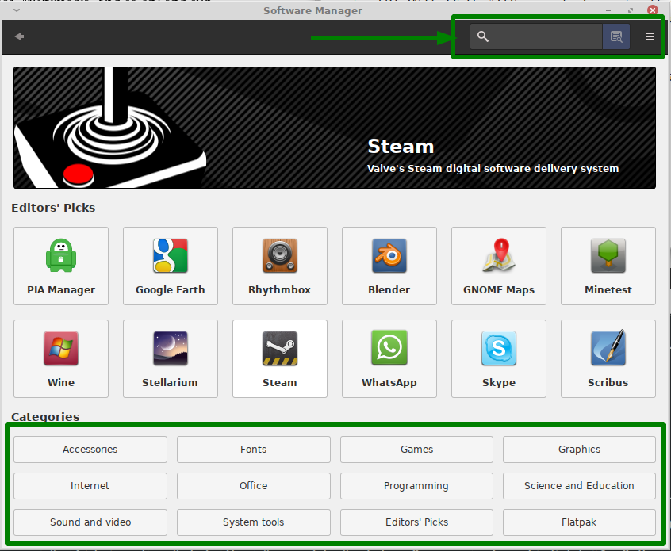

## استفاده از نرم افزار های بهره وری

قلمرو ابزارهای بهره وری به شدت گسترده است؛ صدها یا هزاران ابزار بهره وری وجود دارد که کتب مختلف و معدودی در مورد تعداد زیادی از آنها نوشته شده اند. به همین خاطر، در این بخش تعدادی از این ابزارها را به صورت خلاصه در دسته بندی های رایج مورد بررسی قرار خواهیم داد. این دسته بندی رایج ابزارهای بهره وری شامل موارد زیر می‌شوند:

* **ابزار های مرورگر وب (web browsers)**

* **ابزارهای پست الکترونیکی (email clients)**

* **ابزارهای اداری (office tools)**

* **برنامه های محتوای چند رسانه ای (multimedia applications)**

* **رایانش ابری (cloud computing)**

* **ابزارهای تلفن همراه (mobile applications)**
  
  قبل از توضیح درمورد این ابزارها بهتر است طرفندهایی را که به کمک آنها می‌توان ابزار مناسب کار مشخصی را در لینوکس پیدا کرد، مورد بررسی قرار دهیم.

### پیدا کردن ابزار مناسب برای کار مورد نظر

سیستم عامل گنو/لینوکس ابزارهای بهره وری مختلفی را در دسته بندی های مختلف و گسترده ای ارائه می‌دهد، اما اگر به صورت کامل با این زمینه آشنایی نداشته باشید ممکن است برای پیدا کردن ابزار مورد نظر خود با مشکلاتی مواجه شوید چرا که همیشه نام ابزار مشخص کننده عملکرد و هدف ابزار نیست.

چندین تکنیک که میتوانند به شما در یافتن ابزار مورد نظرتان کمک کنند :

**استفاده از منوهای میزکار**

شما میتوانید از منوها یا سایر ابزارهایی که توسط میزکار برای نمایش لیست ابزارهای نصب شده فراهم شده اند برای یافتن ابزارهای بهره وری نصب شده در سیستم عامل خود بهره ببرید. چنین ابزارهایی معمولاً برنامه‌ها را به صورت کارآمدی دسته بندی می‌کنند. بعنوان مثال Whisker Menu در میزکار Xfce (که قبلاً در تصویر ۴.۲ آن را دیدید) برنامه های موجود و نصب شده را در دسته بندی های مختلفی(مثل Settings, Accessories, Developement, Education, Graphics, Internet, Multimedia, ... ) تقسیم می‌کند. این عمل به شما کمک می‌کند تا به راحتی ابزار مورد نیاز را پیدا کنید. البته فقط ابزارهایی که در سیستم عامل شما نصب شده اند نمایش داده خواهند شد.

**جست و جو**

توجه کنید که روش های مختلفی برای جست و جوی ابزار در زمینه مورد نظرتان وجود دارد. می‌توانید با جست و جو در موتور جست و جوی وب محبوبتان ابزار مورد نظر خود را پیدا کنید، مثلاً اگر ابزارهای office برای سیستم عامل گنو/لینوکس را نیاز دارید کافیست که جمله زیر را جست و جو کنید :

<strong>office tools for linux</strong>

خواهید دید که وبسایت های مختلفی ابزار های مختلفی را برای استفاده به شما پیشنهاد خواهند داد.

امروزه در اکثر توزیع ها و یا محیط های میزکار گنو/لینوکس ابزارهای گرافیکی مدیریت بسته وجود دارند که به صورت هرچه کامل تر ابزارهای موجود و قابل نصب بر روی توزیع مورد استفاده شما را دسته بندی کرده اند و گزینه های مختلفی را برای جست و جو و مدیریت ابزارهای موجود(در مخازن یا سرور میزبانی ابزارهای مورد استفاده شما) فراهم کرده اند که بعنوان مثال در شکل ۴.۱۲ ابزار mintinstall که یک ابزار گرافیکی برای مدیریت بسته ها در توزیع linux mint می‌باشد نمایش داده شده :

> **تصویر ۴.۱۲** در اکثر ابزارهای گرافیکی مدیریت بسته های گنو/لینوکس ابزارها به روش های مختلفی دسته بندی شده اند و شما را برای استفاده و جست و جوی ابزار برای زمینه مورد نظر خودتان یاری می‌کنند.

**یافتن ابزارهای مشابه**

اگر معمولاً یک ابزار مختص MS Windows را استفاده می‌کنید، می‌توانید ابزار مشابه و جایگزین آن را در گنو/لینوکس پیدا کنید. با استفاده از سایت هایی همچون:  [LinuxAlt](https://www.linuxalt.com/) یا [Wiki LinuxQuestions](https://wiki.linuxquestions.org/wiki/Linux_software_equivalent_to_Windows_software).

پیشنهاد مترجم: وبسایت  [AlternativeTo](https://alternativeto.net/) نیز مشابه های مناسبی برای سیستم عامل های مختلف پیشنهاد می‌کند.

**استفاده از تجربه دیگران**

در صورتی که با تحقیق های اولیه ابزاری مشابه برای رفع نیاز خود پیدا نکردید، به راحتی می‌توانید از افراد دیگر - همکاران، دوستان، یا اشخاص حاضر در گفتگو های آنلاین - برای یافتن ابزار مناسب کار خود کمک بگیرید.

 
برخی از این روش ها، مانند استفاده از منو های میزکار، فقط ابزار های نصب شده فعلی روی سیستم عامل را نمایش خواهند داد. روش های دیگر، مانند جستجوی آنلاین، ممکن است به نرم افزاری که نصب نکرده باشید ختم شوند. معمولاً با استفاده از ابزار مدیریت بسته (یا پکیج منیجر / Package manager) که عمدتاً توسط توزیع مورد استفاده شما ارائه می‌شود، به راحتی نرم افزار مد نظر خود را نصب نمایید.

### استفاده از مرورگر وب

لینوکس طیف گسترده ای از مرورگر های وب را پشتیبانی می‌کند: 

**Chromium**

[کرومیوم](https://www.chromium.org/chromium-projects/) یک پروژه متن باز است که امنیت، پایداری و سرعت را برای تجربه کاربران به ارمغان می‌آورد. در واقع این مروگر وب پایه و اساس نرم افزار هایی همچون Google Chrome, Brave, Opera, Microsoft Edge, Epic, Comodo Dragon و... است. همچنین این ابزار در مخزن اصلی اکثر توزیع های لینوکس قرار دارد و به سهولت تمام قابل استفاده خواهد بود.

**Google Chrome**

[مرورگر گوگل کروم](https://www.google.com/chrome/)  مدعی استفاده آسان و سریع بودن است. با انتشار اولین نسخه از ۲۰۰۸ خیلی سریع محبوبیت آن افزایش یافت. هرچند که کروم یک پروژه تجاری است اما به صورت رایگان در دسترس است. 

**Firefox**

[فایرفاکس](http://www.mozilla.org/) یک نرم افزار متن باز است که توسط کمپانی موزیلا و تحت مجوز اختصاصی (متن باز/آزاد) MPL ارائه می‌شود. استاندارد طلایی مرور وب با سرعت، حفظ حریم خصوصی و کنترل، شعار این مرورگر است. معمولا به صورت پیش فرض با اکثر توزیع های لینوکس ارائه می‌شود.

**Gnome Web**
[وب](https://wiki.gnome.org/Apps/Web)، اصالتاً Epiphany، مروگر میزکار Gnome است. اصل طراحی آن بر اساس سادگی و سهولت استفاده است.

**Konqueror**

[Konqueror](https://apps.kde.org/konqueror/)، یکی از نرم افزار های اختصاصی میزکار KDE با عملکردی دوگانه است: یک مروگر وب و یک مدیر فایل. این مرورگر وب، اکثر صفحات وب را به خوبی اجرا می‌کند. یک نرم افزار سبک که خصوصا هنگام استفاده از KDE ارزش استفاده را دارد. 

**Lynx**

اکثر مرورگر های وب، گرافیکی هستند و قابلیت های مختلفی مانند نمایش متون با فونت های متنوع، اجرای انیمیشن های گرافیکی و صفحات مدرن وب و دنیایی از قابلیت های متنوع دیگر را دارند. [Lynx](http://lynx.browser.org/) یک مرورگر وب غیرمعمول مبتنی بر متن است. هنگام اجرای لینوکس در حالت متنی (TTY) یا زمانی‌که قصد دارید صفحات وب را بدون اجرای گرافیک مرور کنید، یک انتخاب مناسب است. برای تست هنگام توسعه نیز بسیار کاربردی خواهد بود، اگر صفحه وب شما در این مروگر خوانا بود، چرا که وبسایت شما بهشت افرادی خواهد بود که از تکنولوژی متن خوان برای مرور صفحات وب استفاده می‌کنند.

> البته باید توجه داشت این امر برای دریافت محتوای وبسایت جهت اوتوماسیون های مختلف و اسکریپت هایی که قابلیت اجرای جاوااسکریپت در صفحات وب را ندارند، بسیار کاربردی خواهد بود.  مرورگر های متنوعی مانند Lynx وجود دارند، مثل :‌ [w3m](https://w3m.sourceforge.net/)، [Elinks](http://elinks.or.cz/) و...

**Opera**

مرورگر [اوپرا](http://www.opera.com/) یک مرورگ غیر عادی تجاری در فهرست رقابتی مروگر های وب لینوکس است. اوپرا مدعی سرعت باورنکردنی است. اگرچه یک مرورگر تجاری است، اما به رایگان در دسترس همگان قرار گرفته. 

مورد قابل توجه این است که مرورگر های Edge و Safari در این فهرست قرار نمی‌گیرند، زیرا انحصاراً به ترتیب برای سیستم عامل های ویندوز و مجموعه سیستم عامل های Apple ایجاد و منتشر می‌شوند. اگرچه استاندارد دنیای وب امروز سازگاری با اکثر مرورگر های وب را پیش نیاز صفحات وب قرار داده، ولی اگر با صفحه ای از وب مواجه شدید که با چنین مرورگر هایی اجرا می‌شد، می‌تواند حداقل با یکی از مرورگر های قابل اجرا در لینوکس نیز اجرا شود. پس برای اطمینان در سیستم عامل لینوکس خود حداقل دو مرورگر وب را نصب داشته باشد.

مرورگر های وب کاربران را به سادگی به دنیایی از اطلاعات متصل میکنند -- به معنای واقعی کلمه! 

متاسفانه دنیای وب وجهه های تاریکی نیز دارد. مواردی از قبیل:‌

* وبسایت ها می‌توانند گزارش اطلاعات مرتبط صفحاتی که توسط کاربران مورد استفاده قرار گرفته را جمع آوری کنند و این اطلاعات در روند بازاریابی به صورتی که مورد استقبال شما نخواهد بود استفاده خواهند شد.

* اکثر محتوای وب، پویا (داینامیک) هستند، به این معنی که وبسایت ها از برنامه های کوچکتری تشکیل شده اند که توسط مرورگر شما دانلود و اجرا خواهند شد، مثل فایل های JavaScript که عملا مرورگر شما مفسر آن هاست.

* وبسایت های نامعتبر معمولاً از روش هایی مختلف (از قبیل مهندسی اجتماعی)، کاربران را ترغیب به استفاده از خود کرده و اطلاعات حساس آن ها، از قبیل اطلاعات حساب بانکی، را به سرقت می‌برند.این تکنیک بعنوان *فیشینگ* (phishing) شناخته می‌شود. فرض کنید وارد linstagram.com شده و در صفحه وبی دقیقا کپی شده همانند صفحه ورود اینستاگرام، اطلاعات حساب کاربری خود را وارد می‌کنید، هر چند که وارد حساب کاربری اصلی خود در instagram.com می‌شوید اما اطلاعات ورود شما به سرقت رفته، چرا که عملکرد ورود شما در وبسایت جعلی بوده که ابتدای آن با حرف L کوچک شما را گمراه کرده است.

* بسیاری از وبسایت ها *ایمن* نیستند، مثلا اگر وبسایتی از پروتکل HTTP استفاده کند، اطلاعات رد و بدل شده بین شما و وبسایت توسط نقطه های اتصال اینترنت قابل مشاهده و خوانا خواهند بود. البته اکثر وبسایت های حساس مانند بانک های الکترونیکی، فروشگاه های حرفه ای و... از ارتباط های امن و رمزنگاری شده HTTPS استفاده می‌کنند و همچنین اطلاعات حساس شما همانند پسورد را رمز نگاری می‌کنند.

> البته در ۲۰۲۵ استاندارد های توسعه وب نیز در سطح دیگری قرار دارد و به صورت پایه ای هر چهارچوب یا ابزار احراز هویت یا مشابه های حساس دیگری که به صورت خارج از جعبه و حرفه ای ارائه می‌شوند، با پروتکل های رمز نگاری متنوع از اطلاعات کاربران محافظت می‌کنند.

* برای این که از جهت امنیت نگران شوید، پسورد های استفاده شده در اکثر وبسایت ها در دست دزدان الکترونیکی قرار دارد. سردرد از جایی شروع می‌شود که نمی‌توان در دنیای امروز برای هر وبسایت، رمز کاربری آن را به خاطر سپرد. البته اکثر مرورگر ها با ذخیره اطلاعات روی حافظه سیستم شما، چنین کاری را انجام می‌دهند که همچنان در تهدید دزیده شدن خواهند بود.

> در فصل ۱۳ راجع به رمز های عبوری که به سادگی در ذهن خواهند ماند و به سختی حدس زده خواهند شد، صحبت خواهیم کرد.

البته، برخی از این مشکلات منحصرا برای وب نیستند. بعنوان مثال اکثر ارائه دهندگان سرویس پست الکترونیک، ایمن نیستند و بهتر است اطلاعات حساس خود را از طریق این پروتکل *ارسال نکنید*.

### ابزارهای پست الکترونیکی

ابزارهای پست الکترونیکی در زمینه ارسال و دریافت نامه های الکترونیکی (ایمیل) کاربرد دارند.

این دسته ابزار یا صندوق پستی شما را در فضای رایانه شخصی اجرا خواهند کرد، یا با استفاده از پروتکل های ایمیل که بعدا به آن ها می‌پردازیم، به کمک سرویس دهنده های شبکه ایمیل عملکرد ارسال و دریافت پیام را در بستر اینترنت فراهم می‌کنند. ابزار های پست الکترونیکی رایج مورد استفاده توسط لینوکس عبارتند از: 

**[Evolution](https://wiki.gnome.org/Apps/Evolution)**

این پروژه از میزکار گنوم، یک کلاینت گرافیکی قدرتمند است. یک نرم افزار تیمی (ارتباط درون تیم) و دارای قابلیت هایی همچون زمان‌بندی است.

**[KMail](https://apps.kde.org/kmail2/)**

تا الان باید متوجه شده باشید که اکثر نرم افزار های میزکار KDE با حرف K شروع می‌شوند، این ابزار نیز کلاینت ایمیل تخصصی این میزکار محسوب می‌شود، البته که می‌توانید در سایر محیط های گرافیکی لینوکس، از این ابزار قدرتمند بهره ببرید.

**[Mutt](http://www.mutt.org/)**

ابزار پست الکترونیکی قابل استفاده در محیط متنی است، البته توجه کنید که نداشتن محیط گرافیکی، دلیل بر ضعف یک ابزار نیست و Mutt یک ابزار قدرتمند است.

**[Thunderbird](https://www.thunderbird.net/en-US/)**

کلاینت ایمیل ارائه شده توسط موزیلا که با مرورگر فایرفاکس ارتباط نزدیکی دارد. ابزاری قدرتمند، حرفه ای و مورد تایید است.

نرم افزارهای سمت کاربر پست الکترونیک (کلاینت ایمیل)، در تمامی سیستم عامل ها عملکرد مشابهی دارند. خیلی ساده در ابتدا باید تنظیمات مرتبط با ارسال و دریافت ایمیل را چه برای شبکه داخلی و چه ارسال از طریق سرویس دهنده، در این نرم افزار ها اعمال کنید.
در این صورت می‌توانید نامه های الکترونیک خود را دریافت و یا ارسال کنید.

### ابزار های اداری (آفیس)

چندین مجموعه ابزار اداری برای لینوکس مهیا شده اند. این بسته های نرم افزاری شامل ابزار هایی همچون پردازنده متن، صفحات گسترده، ابزار های گرافیکی، پایگاه های داده و گاهاً نرم افزار های مرتبط دیگر می‌شوند. از جمله می‌توان به موارد زیر اشاره کرد:

**[Gnome Office](https://wiki.gnome.org/Attic/GnomeOffice)**

نرم افزارهای این مجموعه ابزار اداری، هر کدام یک بسته نرم افزاری مستقل هستند. ولی میزکار گنوم، آن‌ها را در یک مجموعه متصل به هم بسته بندی کرده و ارائه می‌دهد. موارد درون این بسته نرم افزار عبارتند از: 

* AbiWord (پردازنده متن)

* Evince (مشاهده مستندات)

* Evolution (مجموعه ابزار پست الکترونیک)

* Gnumeric (صفحه گسترده)

* Inkscape (وکتور ساز و ایجاد فایل ارائه طرح)

* Ease (ارائه طرح)

**[Calligra](https://calligra.org/)**

**[Apache OpenOffice](https://www.openoffice.org/)**

**[LibreOffice](https://www.libreoffice.org/)**
