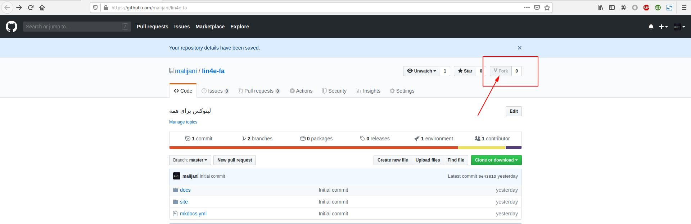
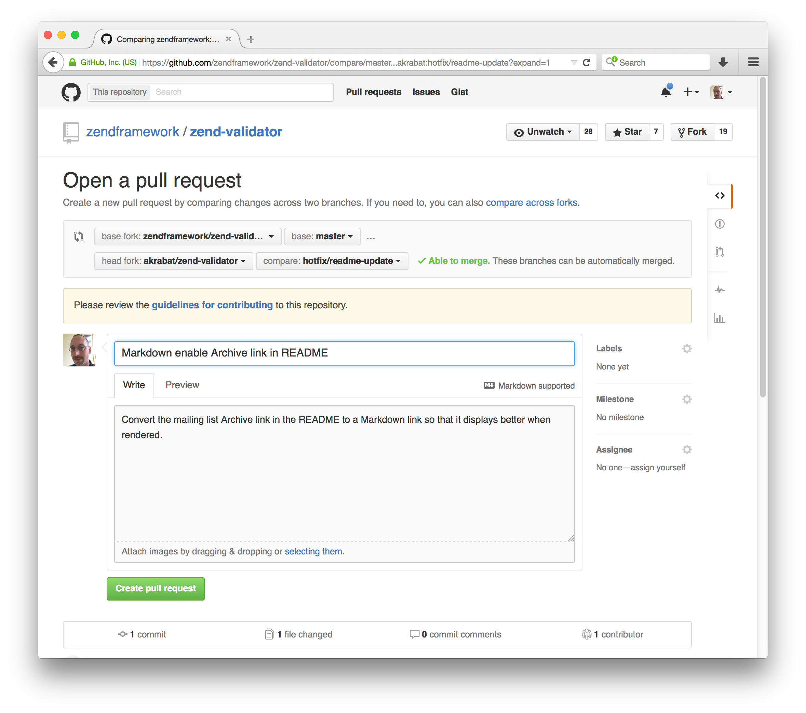

# مشارکت در نوشتن کتاب

به راحتی و روش های مختلف میتونید کمک کنید!:

#### [کمک مالی](https://idpay.ir/lin4e-donation)

#### کمک عملی

* توی [github.com](https://github.com) یه حساب کاربری بسازید.

* وارد آدرس [github.com/malijani/linux-essentials](https://github.com/malijani/linux-essentials) بشید و روی دکمه Fork بفشارید :‌

*  ابزار git و python3 و pip و virtualenv رو نصب کنید(برای پلتفورم های مختلف این ابزار ها ارائه داده شدند. متناسب با سیستم عامل خودتون عمل نصب رو انجام بدید!)
    1. نصب ابزار git : ابزار رو از [اینجا](https://git-scm.com/downloads)دانلود و نصب کنید.
    2. نصب python : آخرین نسخه رو از [اینجا](https://www.python.org/downloads/) دانلود و نصب کنید(هنگام نصب گزینه فعال سازی pip رو هم بزنید)
    3. نصب virtualenv : کافیه دستور زیر رو برای نصب virtualenv بزنید :

<code>pip install virtualenv</code>

* دستور زیر رو اجرا کنید(به جای YOUR_USERNAME نام کاربری گیتهاب خودتون رو بذارید):

<code>git clone https://github.com/YOUR_USERNAME/lin4e-fa</code>

* به lin4e-fa تغییر مسیر بدید و  محیط مجازی توسعه پایتون رو بسازید([راهنمای virtualenv](https://virtualenv.pypa.io/en/latest/userguide/)) :

<code>cd lin4e-fa</code>

<code>virtualenv -p python3 .venv</code>

* محیط مجازی رو فعال کنید :

    Windows :<code>.venv\Scripts\activate</code> 
    Linux:<code>source ./.venv/bin/activate</code>

* ابزار های مورد نیاز پروژه رو در حالی که محیط مجازی پایتون فعال هست رو به کمک pip نصب کنید:

<code>pip install -r requirements.txt</code>

* حالا که محیط توسعه آمادست؛ فقط کافیه تم استفاده شده برای پروژه رو برای راست چین کانفیگ کنید:

file path : <b>.venv/lib/python3.6/site-packages/material/mkdocs_theme.yml</b>

 فایل بالا رو با یک ویرایشگر متن باز کنید و متغیر های زیر رو مقدار دهی کنید :

    <code>language: fa</code> 
    <code>direction: rtl</code>

* برای تغییراتی که قصد اعمال اونها رو دارید یه شاخه جدید توی مخزن بسازید و توی اون کار کنید که با شاخه اصلی قاطی نشه:

<code>git checkout -b USERNAME-changes</code>

* سرور داخلی mkdocs رو برای توسعه و ویرایش راه اندازی کنید :

<code>mkdocs serve</code>

* حالا کافیه محتویات درون مسیر docs رو با markdown ویرایش کنید و تغییرات رو به صورت زنده در مسیر localhost:8000 مشاهده کنید.

* پس از انجام تغییرات دلخواهتون کافیه به کمک git اونا رو ذخیره کنید و به مخزن روی سرور گیتهابتون که از مخزن اصلی فرستاده شده بفرستید:

<code>git add .</code>

<code>git commit -m "Changed FILE Fixed ISSUE"</code>

<code>git push -u origin USERNAME-changes</code>

* وارد حساب کاربری گیتهاب و مخزن فورک شده lin4e-fa بشید ؛ حالا روی دکمه New pull request بزنید ، موضوع تغییرات رو تعیین کنید و برای اون ها توضیحاتی بیارید و دکمه Create pull request رو بزنید تا ایجاد بشه:

(مثالی برای انتخاب موضوع و توضیحات):

