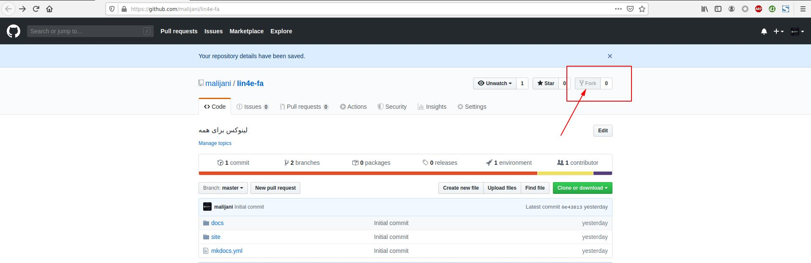
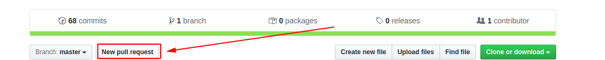
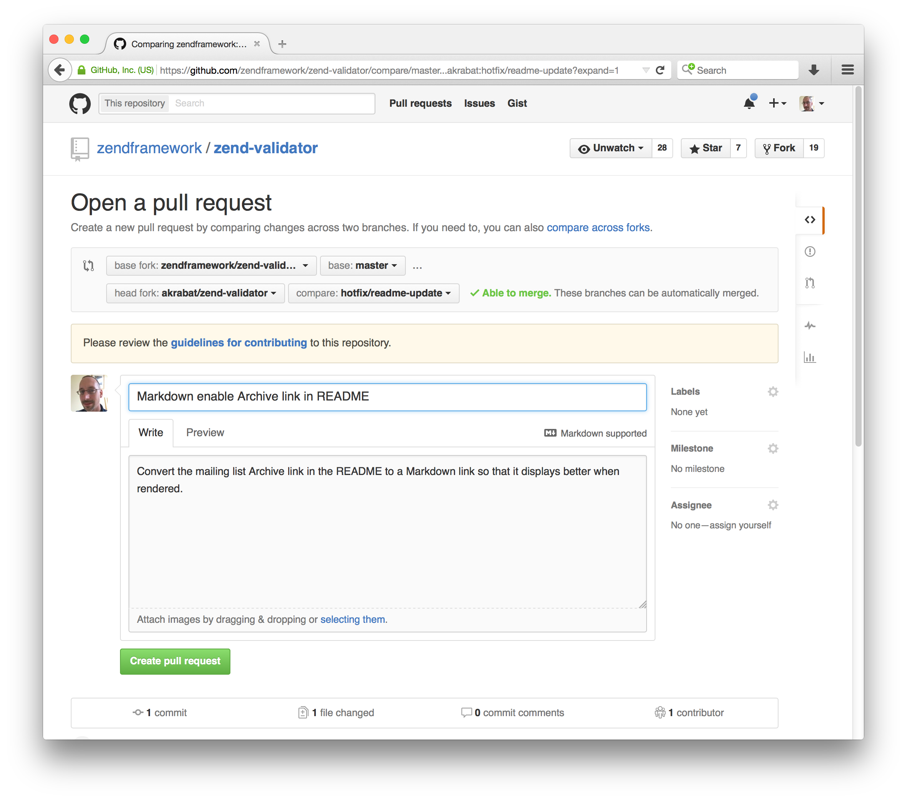

# مقدمه

## تناسب این کتاب با شما

این کتاب درمورد سیستم عامل گنو/لینوکس هست! خب شاید اولین باره که این اسم به گوشتون میخوره، بنظرم خوندن این [مقاله](https://toranji.ir/2017/11/20/%D8%AF%D8%B1-%D9%85%D9%88%D8%B1%D8%AF-%DA%AF%D9%86%D9%88%D9%84%DB%8C%D9%86%D9%88%DA%A9%D8%B3-%DA%86%D9%87-%D9%85%DB%8C%E2%80%8C%D8%AF%D8%A7%D9%86%DB%8C%D8%AF%D8%9F-%D8%A2%DB%8C%D8%A7-%D9%88%D8%A7/) خالی از لطف نباشه. اگر این سیستم عامل رو مناسب تر از چیزی که در حال حاضر دارید استفاده میکنید(ویندوز/مک/...) میتونید دوباره به کتاب برگردید و به خوندن ادامه بدید.

## در مورد کتاب

بخش های عمده این منبع روی معرفی گنو/لینوکس، بخش های پایه ای این سیستم عامل به همراه آموزش اسکریپت نویسی BASH برای کنترل و انجام خودکار وظایف سیستم عامل متمرکز شده است.

پس از این که کمبود یک کتاب مناسب برای یادگیری لینوکس، مختص افراد علاقه مندی که آشنایی زیادی با این سیستم عامل ندارند و اشخاصی که در حد نیاز های روزانه به این سیستم احتیاج دارند تصمیم گرفتم چنین کتابی را بر اساس تجربیات خودم بعنوان یک علاقه مند به دنیای نرم افزار آزاد و گنو/لینوکس نوشته و منتشر کنم.

## مجوز کتاب

این کتاب آموزشی تحت مجوز GNU Free Documentation ارائه شده ([بیشتر بدانید](https://www.gnu.org/licenses/fdl-1.3.en.html)) و اگر قصد استفاده از محتوای این کتاب را دارید لطفا طبق این مجوز برخورد کنید.

## کمک به نوشتن کتاب

به راحتی و روش های مختلف میتونید در نوشتن این کتاب مشارکت کنید!:

1. توی [github.com](https://github.com) یه حساب کاربری بسازید.

2. وارد آدرس [github.com/malijani/lin4e-fa](https://github.com/malijani/lin4e-fa) بشید و روی دکمه Fork بفشارید :‌

3. ابزار git و python3 و pip و virtualenv رو نصب کنید(برای پلتفورم های مختلف این ابزار ها ارائه داده شدند. متناسب با سیستم عامل خودتون عمل نصب رو انجام بدید!)
    1. نصب ابزار git : ابزار رو از [اینجا](https://git-scm.com/downloads)دانلود و نصب کنید.
    2. نصب python : آخرین نسخه رو از [اینجا](https://www.python.org/downloads/) دانلود و نصب کنید(هنگام نصب گزینه فعال سازی pip رو هم بزنید)
    3. نصب virtualenv : کافیه دستور زیر رو برای نصب virtualenv بزنید :

<code>pip install virtualenv</code>

4. دستور زیر رو اجرا کنید(به جای YOUR_USERNAME نام کاربری گیتهاب خودتون رو بذارید):

<code>git clone https://github.com/YOUR_USERNAME/lin4e-fa</code>

5. به lin4e-fa تغییر مسیر بدید و  محیط مجازی توسعه پایتون رو بسازید([راهنمای virtualenv](https://virtualenv.pypa.io/en/latest/userguide/)) :

<code>cd lin4e-fa</code>

<code>virtualenv -p python3 .venv</code>

6. محیط مجازی رو فعال کنید :

    Windows :<code>.venv\Scripts\activate</code> 
    Linux:<code>source ./.venv/bin/activate</code>

7. ابزار های مورد نیاز پروژه رو در حالی که محیط مجازی پایتون فعال هست رو به کمک pip نصب کنید:

<code>pip install -r requirements.txt</code>

8. حالا که محیط توسعه آمادست؛ فقط کافیه تم استفاده شده برای پروژه رو برای راست چین کانفیگ کنید:

file path : <b>.venv/lib/python3.6/site-packages/material/mkdocs_theme.yml</b>

 فایل بالا رو با یک ویرایشگر متن باز کنید و متغیر های زیر رو مقدار دهی کنید :

    <code>language: fa</code> 
    <code>direction: rtl</code>

9. برای تغییراتی که قرار هست اعمال کنید یه شاخه جدید توی مخزن بسازید و توی اون کار کنید که با شاخه اصلی قاطی نشه:

<code>git checkout -b USERNAME-changes</code>

10. سرور داخلی mkdocs رو برای توسعه و ویرایش راه اندازی کنید :

<code>mkdocs serve</code>

11. حالا کافیه محتویات درون مسیر docs رو با markdown ویرایش کنید و تغییرات رو به صورت زنده در مسیر localhost:8000 مشاهده کنید.

12. پس از انجام تغییرات دلخواهتون کافیه به کمک git اونا رو ذخیره کنید و به مخزن روی سرور گیتهابتون که از مخزن اصلی فرستاده شده بفرستید:

<code>git add .</code>

<code>git commit -m "Changed FILE Fixed ISSUE"</code>

<code>git push -u origin USERNAME-changes</code>

12. وارد حساب کاربری گیتهاب و مخزن فورک شده lin4e-fa بشید ؛ حالا روی دکمه New pull request بزنید ، موضوع تغییرات رو تعیین کنید و برای اون ها توضیحاتی بیارید و دکمه Create pull request رو بزنید تا ایجاد بشه:

(مثالی برای انتخاب موضوع و توضیحات):

